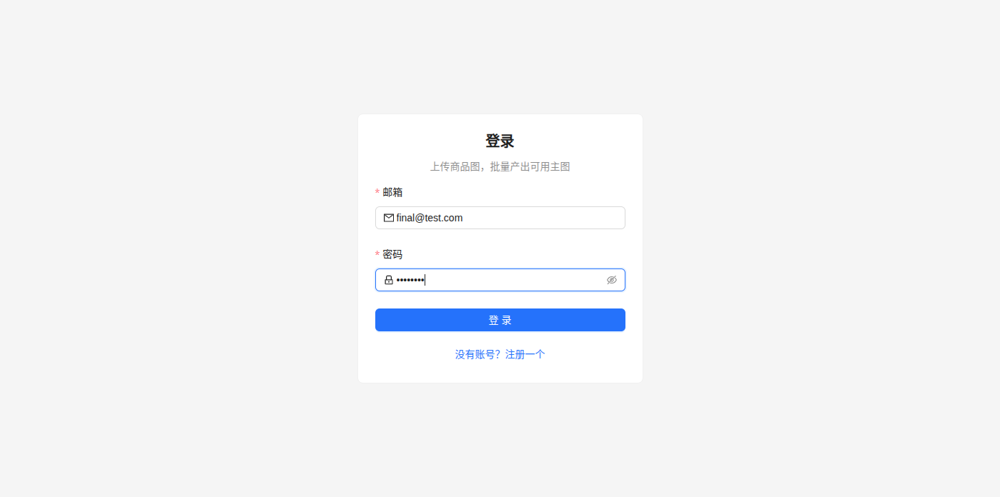
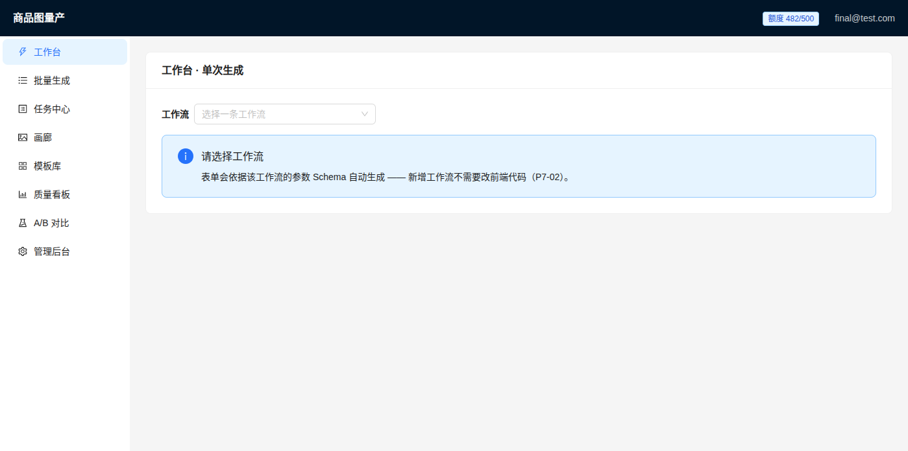
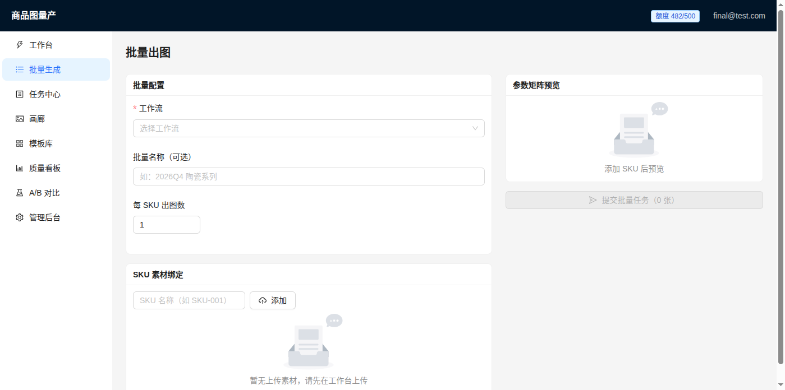
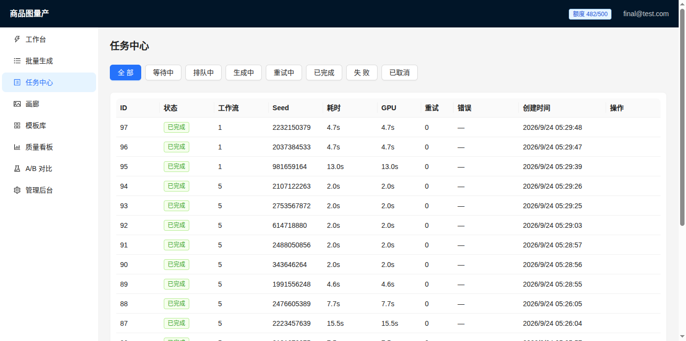
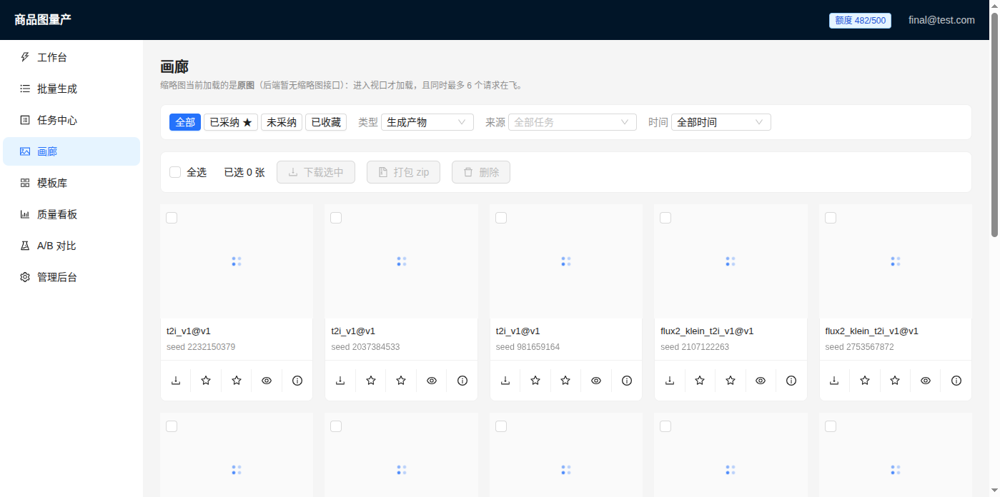
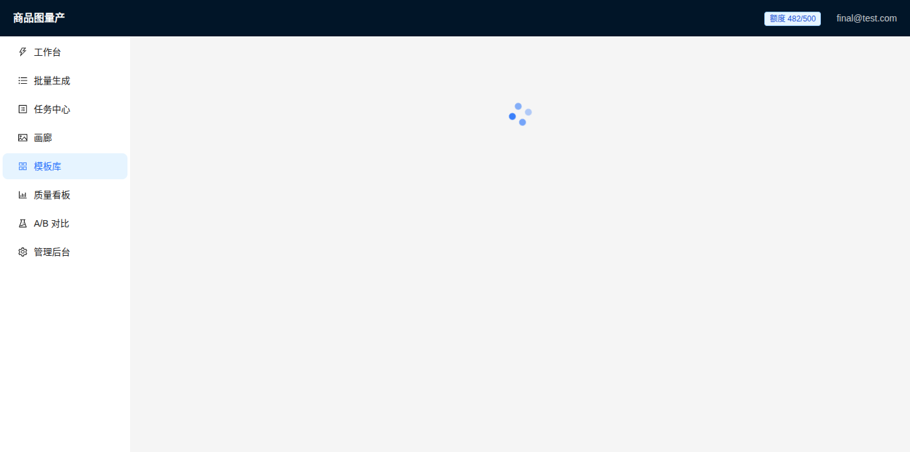
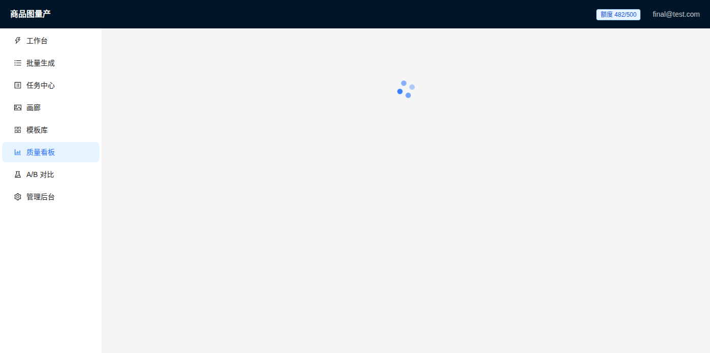
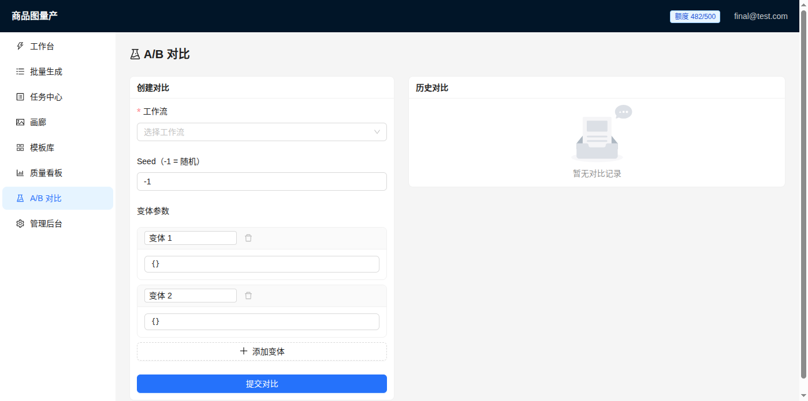
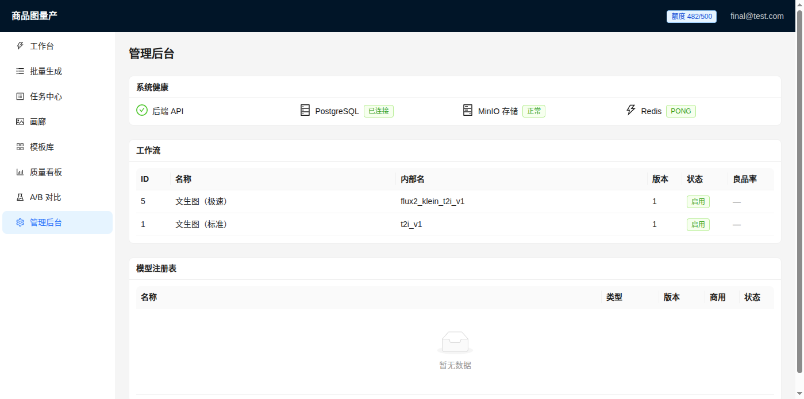

# ComfyUI E-Commerce Vision Platform

> 基于 ComfyUI 的**商用级** AIGC 视觉生产平台 —— 把「能跑通的节点工具」封装成「可量产、可观测、可核算、可迭代」的商品视觉生产线。
>
> A **commercial-grade** AIGC visual production platform built on ComfyUI — wrapping node-based tools into a mass-production, observable, accountable, and iterative product visual pipeline.

[](./LICENSE)
[](https://www.python.org/)
[](https://github.com/comfyanonymous/ComfyUI)

**当前状态**：🚧 V1 开发中（2026-09-14 启动，目标 2026-11-22 发布）

---

## 它解决什么问题

电商商家要出商品主图/场景图，现有方案都不理想：

| 方案 | 问题 |
|---|---|
| 请摄影 + 修图 | 贵、慢、SKU 多了根本排不过来 |
| Midjourney 等在线工具 | 出图不可控、风格漂移、无法批量、商品主体会被改形 |
| 直接用 ComfyUI | 参数多、门槛高、批量易崩、没有任务管理与成本概念 |

**本项目做的事**：把经过验证的 ComfyUI 工作流封装成场景模板，配上一层生产平台（任务队列、批量、良品率度量、成本核算、用户与素材管理），让非技术同学 10 分钟出 100 张可用图。

---

## 核心能力

### 工作流（V1 全覆盖）

| 能力 | 状态 | 说明 |
|---|---|---|
| 文生图 | 🚧 | 底模 + 采样器 + 高清分支 |
| 图生图 | 🚧 | 重绘幅度策略 |
| 高清修复 | 🚧 | 放大 + tile 分块 + 细节重绘 |
| 局部重绘 | 🚧 | mask 输入 → inpaint / BrushNet |
| 风格迁移 | 🚧 | IP-Adapter + LoRA + 风格模板 |
| 批量出图 | 🚧 | 参数矩阵 / CSV 驱动 / 断点续跑 |

### 控制体系

ControlNet（canny / depth / lineart / softedge / normal / openpose）· IP-Adapter · LoRA（多权重叠加）· SAM/SAM2 自动分割遮罩 · DWPose 姿态 · 景深/法线/线稿联合控制

### 平台层

- **异步任务队列**：优先级、并发控制、超时、失败自动降级重试、断点续跑
- **质量度量**：golden set 评测集 + 良品率看板 + 自动质检
- **成本核算**：GPU 秒 → 单张成本模型
- **可观测**：全链路 trace（task → 工作流 → 参数 → 耗时/显存）+ 系统监控 + 告警
- **可复现**：工作流版本 + 模型 hash + seed + 全参数写入产物元数据
- **用户与权限**：鉴权、配额限流、素材隔离、审计日志

---

## 产品截图 / Product Screenshots

### 登录页 / Login Page

*用户注册与登录，JWT 鉴权，配额显示 / User registration and login, JWT authentication, quota display*

### 工作台 / Workbench

*单次生成：选择工作流 → 动态参数表单 → 一键出图 / Single generation: select workflow → dynamic parameter form → one-click generation*

### 批量生成 / Batch Generation

*批量出图：SKU 素材绑定 + 参数矩阵 + 断点续跑 / Batch generation: SKU asset binding + parameter matrix + retry failed only*

### 任务中心 / Task Center

*任务列表：状态筛选、耗时、GPU 占用、重试次数、错误信息 / Task list: status filter, duration, GPU usage, retry count, error details*

### 画廊 / Gallery

*产物画廊：缩略图懒加载、筛选、批量操作（采纳/收藏/下载/删除）/ Asset gallery: lazy-loaded thumbnails, filters, bulk actions (adopt/favorite/download/delete)*

### 模板库 / Template Library

*场景模板：按品类筛选、搜索、一键复用参数 / Scene templates: filter by category, search, one-click parameter reuse*

### 质量看板 / Quality Dashboard

*质量度量：产物统计、任务成功率、平均耗时、按工作流质量分析 / Quality metrics: asset stats, task success rate, avg duration, per-workflow quality analysis*

### A/B 对比 / A/B Comparison

*A/B 对比：同 Seed 不同参数并排出图，支持多变体 / A/B comparison: same seed different params side-by-side, multi-variant support*

### 管理后台 / Admin Dashboard

*管理后台：系统健康检查、数据概览、工作流管理、模型注册表 / Admin: system health checks, data overview, workflow management, model registry*

---

## 架构

```
┌──────────────────────────────────────────────────────┐
│  Web 前端 · React + TS                                │
│  工作台 · 任务中心 · 画廊 · 批量向导 · 模板库 · 管理台  │
└───────────────────┬──────────────────────────────────┘
                    │ REST + WebSocket
┌───────────────────▼──────────────────────────────────┐
│  API 层 · FastAPI                                      │
│  鉴权 · 限流 · 校验 · 任务编排 · 回调                   │
└───────────────────┬──────────────────────────────────┘
                    │
┌───────────────────▼──────────────────────────────────┐
│  任务队列 · Celery + Redis                             │
│  优先级 · 重试 · 降级 · 并发上限                        │
└───────────────────┬──────────────────────────────────┘
                    │
┌───────────────────▼──────────────────────────────────┐
│  ComfyUI 适配层 · HTTP + WebSocket Driver              │
└───────────────────┬──────────────────────────────────┘
                    │
┌───────────────────▼──────────────────────────────────┐
│  ComfyUI 引擎 + 工作流注册表 + 模型库 + 节点白名单      │
└──────────────────────────────────────────────────────┘

存储：PostgreSQL（元数据）· MinIO（素材与产物）· Redis（队列与缓存）
观测：Prometheus + Grafana + Loki · 产品埋点看板
```

---

## 目录结构

```
├── docs/            产品与工程文档（MRD/PRD/画像/流程/原型/SOP/ADR/复盘）
├── engine/          ComfyUI 适配层、工作流注册表、模型注册
├── server/          FastAPI 服务、任务队列、鉴权、存储
├── web/             前端
├── workflows/       工作流 JSON + 参数 Schema（版本化）
├── assets/          提示词库（模型权重不入库）
├── deploy/          Docker 与部署配置
└── tests/           功能 / 性能 / 质量评测
```

---

## 快速开始

> 当前处于开发阶段（V1 进行中），**产品形态的平台尚未封装完成**，还没有面向最终用户的一键部署。
> 开发环境可以手动跑通端到端出图。

| 我想… | 看这里 |
|---|---|
| **15 分钟从零到出一张图** | [`docs/sop/quickstart.md`](./docs/sop/quickstart.md) |
| 深入了解环境、排错、加模型、跑基准 | [`docs/sop/runbook.md`](./docs/sop/runbook.md) |
| 了解产品要做什么 | [`docs/prd/PRD_v1.md`](./docs/prd/PRD_v1.md) · [`docs/mrd/MRD_v1.md`](./docs/mrd/MRD_v1.md) |

### 最短路径（概要）

```bash
# 0) 前置：本机装 sshpass，并从 autoDL 控制台取得实例密码（不要写进仓库）
export SSHPASS='<实例密码>'

# 1) autoDL 控制台：先看 GPU 空闲数，再开机（出图必须有卡模式）

# 2) 启动 ComfyUI（生产配置，幂等）
sshpass -e ssh -p 22910 root@connect.westc.seetacloud.com \
  'bash /root/autodl-tmp/03_start_comfyui.sh'

# 3) 本机建隧道（保持前台运行），然后浏览器打开 http://127.0.0.1:8188
sshpass -e ssh -N -L 127.0.0.1:8188:127.0.0.1:8188 -p 22910 root@connect.westc.seetacloud.com

# 4) 把 workflows/flux2_klein_t2i_v1.json 拖进画布 → Run
```

前置条件：autoDL 实例（RTX 4090 24G / CUDA 13 / Python 3.12）、本机 `sshpass`、Python 3.10+。

当前环境基线见 [`deploy/versions.lock`](./deploy/versions.lock)：
ComfyUI v0.36.0 + torch 2.13.0+cu130，生产启动参数 `--highvram`。
实测稳态：SDXL 1024²/30 步 **4.59s**（地板）/ FLUX.2 klein 4 步 **1.52s**（地板）。

---

## API 接口文档 / API Reference

后端基于 **FastAPI**，启动后自动生成交互式文档：

| 文档 | 地址 | 说明 |
|---|---|---|
| **Swagger UI** | `http://{host}:8011/docs` | 交互式，可直接在页面上测试所有接口 |
| **OpenAPI JSON** | `http://{host}:8011/openapi.json` | 机器可读规范，可导入 Postman / Insomnia |

### 接口一览 / Endpoint Summary

<details>
<summary>点击展开全部 33 个接口（Click to expand all 33 endpoints）</summary>

#### 认证 / Authentication

| 方法 | 路径 | 说明 |
|---|---|---|
| `POST` | `/api/v1/auth/register` | 注册新用户（Register） |
| `POST` | `/api/v1/auth/login` | 登录，返回 JWT（Login, returns JWT） |
| `GET` | `/api/v1/auth/me` | 当前用户信息与配额（Current user & quota） |

#### 工作流 / Workflows

| 方法 | 路径 | 说明 |
|---|---|---|
| `GET` | `/api/v1/workflows` | 工作流列表（List workflows） |
| `GET` | `/api/v1/workflows/{name}/schema` | 获取参数 Schema，前端渲染动态表单（Get param schema for dynamic form） |

#### 任务 / Tasks

| 方法 | 路径 | 说明 |
|---|---|---|
| `POST` | `/api/v1/tasks` | 提交单次生成任务（Submit a generation task） |
| `GET` | `/api/v1/tasks` | 任务列表，支持分页（List tasks, paginated） |
| `GET` | `/api/v1/tasks/{task_id}` | 任务详情（Task detail） |
| `POST` | `/api/v1/tasks/{task_id}/cancel` | 取消任务（Cancel task） |
| `POST` | `/api/v1/tasks/{task_id}/retry` | 重试任务（Retry task） |
| `POST` | `/api/v1/tasks/estimate` | 提交前预估耗时与成本（Estimate before submit） |

#### 批量任务 / Batch Tasks

| 方法 | 路径 | 说明 |
|---|---|---|
| `POST` | `/api/v1/batches` | 提交批量任务（Submit batch） |
| `GET` | `/api/v1/batches` | 批量列表（List batches） |
| `GET` | `/api/v1/batches/{batch_id}` | 批量详情（Batch detail） |
| `POST` | `/api/v1/batches/{batch_id}/retry-failed` | 断点续跑：只重跑失败项（Retry failed only） |

#### 素材与产物 / Assets

| 方法 | 路径 | 说明 |
|---|---|---|
| `POST` | `/api/v1/assets` | 上传素材（Upload asset） |
| `GET` | `/api/v1/assets` | 素材列表（List assets） |
| `GET` | `/api/v1/assets/{asset_id}` | 素材详情（Asset detail） |
| `GET` | `/api/v1/assets/{asset_id}/content` | 取图，返回图片二进制（Get image binary） |
| `PATCH` | `/api/v1/assets/{asset_id}` | 标记采纳 / 收藏（Mark adopted / favorite） |
| `DELETE` | `/api/v1/assets/{asset_id}` | 删除素材（软删除 / Soft delete） |
| `POST` | `/api/v1/assets/pack` | 打包下载（Pack & download） |

#### 模板 / Templates

| 方法 | 路径 | 说明 |
|---|---|---|
| `GET` | `/api/v1/templates` | 模板库（List templates） |
| `POST` | `/api/v1/templates` | 新增模板，需管理员权限（Create template, admin only） |
| `GET` | `/api/v1/templates/categories` | 模板品类列表（List template categories） |

#### 模型与质量 / Models & Quality

| 方法 | 路径 | 说明 |
|---|---|---|
| `GET` | `/api/v1/models` | 模型清单，含商用许可状态（Model list with license info） |
| `GET` | `/api/v1/stats/quality` | 质量看板数据（Quality dashboard stats） |

#### A/B 对比 / Comparison

| 方法 | 路径 | 说明 |
|---|---|---|
| `GET` | `/api/v1/compare` | 列出所有对比组（List comparison groups） |
| `POST` | `/api/v1/compare` | 提交 A/B 对比（Submit comparison） |
| `GET` | `/api/v1/compare/{group_id}` | 对比组详情（Comparison detail） |

#### 健康检查 / Health

| 方法 | 路径 | 说明 |
|---|---|---|
| `GET` | `/health` | 存活探针（Liveness probe） |
| `GET` | `/health/ready` | 就绪探针，检查下游依赖（Readiness probe） |

</details>

### 快速测试 / Quick Test

```bash
# 注册 / Register
curl -X POST http://localhost:8011/api/v1/auth/register \
  -H "Content-Type: application/json" \
  -d '{"email":"test@example.com","password":"yourpassword"}'

# 登录 / Login
TOKEN=$(curl -s -X POST http://localhost:8011/api/v1/auth/login \
  -H "Content-Type: application/json" \
  -d '{"email":"test@example.com","password":"yourpassword"}' | jq -r '.access_token')

# 提交生图任务 / Submit generation task
curl -X POST http://localhost:8011/api/v1/tasks \
  -H "Authorization: Bearer $TOKEN" \
  -H "Content-Type: application/json" \
  -d '{"workflow_name":"t2i_v1","params":{"prompt":"a red ceramic cup, product photo","width":1024,"height":1024}}'

# 查看任务状态 / Check task status
curl http://localhost:8011/api/v1/tasks/1 -H "Authorization: Bearer $TOKEN"

# 获取产物图片 / Get output image
curl http://localhost:8011/api/v1/assets/1/content -H "Authorization: Bearer $TOKEN" -o output.png
```

---

## 路线图

| 版本 | 周期 | 主题 | 关键目标 |
|---|---|---|---|
| **V1** | 2026-09 ~ 2026-11 | 电商视觉量产闭环 | **5 条**工作流（**+1 条顺延 V2**，见 [ADR-008](./docs/adr/0008-v1-scope-reduction.md)） + 控制体系 + 平台 + 质量度量 + 文档 |
| **V2** | 2026-11 ~ 2027-01 | 一致性与平台化 | IP/商品一致性、场景合成、团队协作、开放 API + 计费、LLM 提示词助手 |
| **V3** | 2027-01 ~ 2027-03 | 视频与智能化 | AI 视频链路、Agent 自评闭环、多机多卡、模板市场 |

详细执行计划见 [`todolist.md`](./todolist.md)，进度跟踪见 [`项目进度.md`](./项目进度.md)。

---

## 文档索引

| 类别 | 位置 |
|---|---|
| 执行计划 | [`todolist.md`](./todolist.md) · [`项目进度.md`](./项目进度.md) |
| **进展与问题处置纪实** | [`项目进展.md`](./项目进展.md) |
| **环境操作手册** | [`docs/sop/quickstart.md`](./docs/sop/quickstart.md)（快速上手）· [`docs/sop/runbook.md`](./docs/sop/runbook.md)（详细说明） |
| 产品文档 | `docs/mrd/` · `docs/prd/` · `docs/persona/` · `docs/flow/` · `docs/prototype/` |
| 架构决策 | [`docs/adr/`](./docs/adr/) |
| 工程 SOP | `docs/sop/`（按下面第一份文档补齐工作流规范、控制矩阵、调优指南） |
| 环境基线 | [`deploy/versions.lock`](./deploy/versions.lock) · [`deploy/autodl/`](./deploy/autodl/) |
| 复盘 | `docs/review/` |

---

## 许可证与合规

- 本仓库自研代码与文档：**MIT**（见 [LICENSE](./LICENSE)）
- ComfyUI 本体为 GPL-3.0，本项目不修改、不分发其源码，仅以独立进程通过 API 调用
- **模型权重不受本项目许可证覆盖**，商用前必须逐一核对，见 [`docs/sop/license_matrix.md`](./docs/sop/license_matrix.md)

---

## 声明

本项目为个人作品集项目，用于展示 ComfyUI 商用级封装与 AIGC 产品化的工程实践能力。
