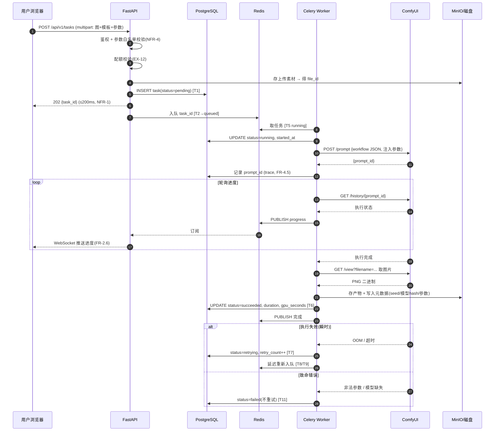
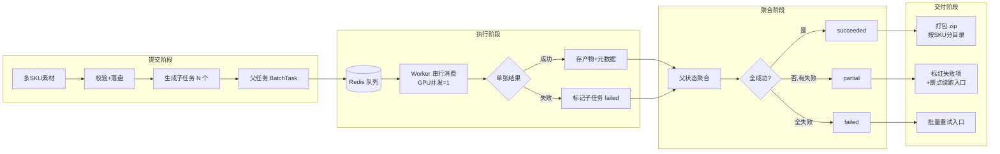

# 系统流程图与数据流图

> 版本：v1.0 · 日期：2026-09-15 · 作者：Peterwong666
> 上游：`../prd/PRD_v1.md` §4 NFR · §5 状态机 · `todolist.md` §3 技术架构
> 覆盖任务：**P1-15**
> **实线 = V1 已实现/已验证**，**虚线 = V1 待实现**。避免把设计图当成现状。

---

## 1. 部署拓扑

```
┌──────────────────────────────────────────────────────────────┐
│  用户浏览器                                                    │
└────────────────────────┬─────────────────────────────────────┘
                         │ HTTPS
┌────────────────────────▼─────────────────────────────────────┐
│  Nginx（反向代理 / TLS / 静态资源）              [V1 待实现]     │
└────────┬──────────────────────────────────┬──────────────────┘
         │ /api/*                           │ /ws/*
┌────────▼──────────────────────────────────▼──────────────────┐
│  FastAPI 应用                                                  │
│  ├─ Auth / 用户 / 配额      (JWT)                              │
│  ├─ 任务 API（提交/查询/取消/重试）                              │
│  ├─ 素材与产物 API                                              │
│  ├─ 模板与工作流 API                                            │
│  └─ WebSocket 进度推送                                          │
└───┬──────────────┬──────────────┬──────────────┬──────────────┘
    │              │              │              │
    │ SQL          │ 队列          │ 对象存储      │ 进度广播
┌───▼────┐   ┌─────▼─────┐   ┌────▼────┐   ┌────▼─────┐
│Postgres│   │  Redis    │   │  MinIO  │   │  Redis   │
│元数据  │   │ 队列+缓存  │   │ 图片对象 │   │ Pub/Sub  │
└────────┘   └─────┬─────┘   └─────────┘   └──────────┘
                   │ 任务出队
            ┌──────▼───────────────────────────┐
            │  Celery Worker（GPU 并发 = 1）    │
            │  ├─ 工作流参数装配                │
            │  ├─ 调 ComfyUI HTTP API          │
            │  ├─ 轮询 /history 取结果          │
            │  └─ 状态机迁移 T1~T14             │
            └──────┬───────────────────────────┘
                   │ HTTP 127.0.0.1:8188（不对外）★
            ┌──────▼───────────────────────────┐
            │  ComfyUI v0.3.75（推理引擎）      │
            │  ├─ /prompt  提交工作流           │
            │  ├─ /history 取执行结果           │
            │  ├─ /view    取图片二进制          │
            │  └─ /ws     执行进度              │
            └──────┬───────────────────────────┘
                   │ 读写
            ┌──────▼───────────────────────────┐
            │  数据盘 /root/autodl-tmp/         │
            │  comfyui-data/{models,input,output}│
            └──────────────────────────────────┘
```

★ **安全边界**：ComfyUI **无鉴权**，端口必须只绑 `127.0.0.1`，
由 FastAPI 做鉴权与参数校验后转发。裸奔 = 送 GPU。（NFR-4）

---

## 2. 单次生成请求时序



### 2.1 为什么是「轮询 /history」而不是只靠 WebSocket

ComfyUI 同时提供 `/ws` 与 `/history`：

| 方式 | 优点 | 缺点 | 本项目用法 |
|---|---|---|---|
| WebSocket | 实时 | 连接易断，需重连与补偿逻辑 | **辅助**：用于实时进度 |
| HTTP 轮询 `/history` | 简单、幂等、可恢复 | 有延迟 | **主用**：作为状态**唯一可信源** |

> **设计决策**：进度的**权威状态以 `/history` 为准**，WebSocket 只做加速展示。
> 理由：网络抖动时 WebSocket 丢帧会导致状态永久错乱，而轮询天然自愈。
> 这也直接满足 NFR-3「优雅重启后任务可恢复」。

---

## 3. 批量任务数据流



### 3.1 子任务粒度选择

| 方案 | 说明 | 结论 |
|---|---|---|
| 1 任务 = 1 次 ComfyUI 调用（一张图） | 粒度细，失败隔离好，续跑精确 | ✅ **采用** |
| 1 任务 = 1 个 SKU 的全部图 | 粒度中，单 SKU 内失败需重跑整组 | ❌ |
| 1 任务 = 整批 | 粒度粗，一处失败全批重来 | ❌ 正是画像②的痛点 |

> **关键理由**：选「一张图 = 一个子任务」是为了支持 **FR-3.5 断点续跑精确到张**。
> 代价是 200 张 = 201 条数据库记录，但这是可接受的（NFR-2 要求队列支持 10000 任务）。

---

## 4. 状态持久化与恢复

```
                       ┌─────────────────┐
                       │   PostgreSQL    │  ← 状态权威源
                       │  task / batch   │
                       └────────┬────────┘
                                │
   Worker 心跳 ────────────────▶│ heartbeat_at
                                │
   ┌────────────────────────────▼────────────────────────────┐
   │  进程启动时的僵尸任务扫描 (T14 / EX-7)                    │
   │  SELECT * FROM task                                     │
   │   WHERE status='running'                                │
   │     AND heartbeat_at < now() - interval '5 min'         │
   │  → UPDATE status='queued'  (重新入队)                    │
   └─────────────────────────────────────────────────────────┘
                                │
                                ▼
                     任务不丢失，自动恢复（NFR-3）
```

**为什么用「心跳 + 超时」而不是「进程退出时清理」**：
Worker 可能被 `kill -9` 或 OOM Killer 杀掉，**没有机会执行任何清理代码**。
只有心跳超时这种「被动检测」才能覆盖这种情况。

---

## 5. 存储设计

| 类型 | 位置 | 内容 | 生命周期 |
|---|---|---|---|
| **模型** | 数据盘 `comfyui-data/models/{checkpoints,unet,vae,text_encoders,loras,controlnet}` | 底模与权重 | 长期，带 hash + license 登记 |
| **用户素材** | MinIO `uploads/{user_id}/{file_id}` | 上传的商品图 | 用户删除前保留 |
| **产物** | MinIO `outputs/{user_id}/{task_id}/{idx}.png` | 生成结果 | 可配置保留期 |
| **临时** | ComfyUI `output/`（数据盘） | 引擎中间产物 | 定期清理 |
| **元数据** | PostgreSQL | task / batch / 参数 / trace | 长期（审计） |

### 5.1 为什么模型放数据盘而不是 MinIO

| 方案 | 优点 | 缺点 | 结论 |
|---|---|---|---|
| 模型放 MinIO，用时下载 | 与产物统一管理 | **每次加载要下 7-23GB，完全不可行** | ❌ |
| 模型放本地数据盘（软链进 ComfyUI） | 加载快，ComfyUI 原生支持 | 多机部署需共享存储 | ✅ **V1 采用** |

> **V1 决策依据**：单机部署，模型常驻本地。多机场景（E10）V3 再考虑共享存储方案。
> 当前已实测：软链方案可行（见 `项目进展.md` #4）。

---

## 6. 与外部系统的交互

| 外部系统 | 用途 | 失败处理 |
|---|---|---|
| ComfyUI HTTP API | 提交/查询/取图 | 健康检查失败 → 重启实例（EX-8） |
| ComfyUI WebSocket | 实时进度（辅助） | 断连 → 降级为纯轮询 |
| hf-mirror.com | 模型下载（构建期，非运行时） | 断点续传（aria2c -c） |

> **注意**：模型下载**只在构建期发生**，运行时不访问外网。
> 这是商用部署的必要条件（客户环境可能没外网，E9 私有化）。

---

## 7. 数据流与合规

```
用户素材 → 上传 → [校验] → 存储 → 送入 ComfyUI → 产物 → 下载
              │
              └─ 埋点只记元信息（尺寸/格式/数量）
                 不做内容级分析（PRD §7.1 原则 3）
```

| 合规点 | 措施 | 状态 |
|---|---|---|
| 模型商用许可 | registry 记录 license，未知即不用 | ✅ 已建矩阵 |
| ComfyUI GPL-3.0 | 不 fork，仅 API 调用 | ✅ ADR-002 |
| 生成标识 | 元数据写入（V1）→ C2PA（V2） | ⚠️ V1 部分 |
| NSFW 过滤 | FR-9.4 | 待实现 |
| 数据隔离 | user_id 隔离 | 待实现 |
| 审计 | 登录/提交/删除留痕 | 待实现 |

---

## 8. 已实现 vs 待实现（诚实清单）

| 组件 | 状态 | 证据/说明 |
|---|---|---|
| ComfyUI 推理引擎 | ✅ 已跑通 | SDXL 出图 12.0s（`项目进展.md` #8.5） |
| ComfyUI HTTP API 调用 | ✅ 已跑通 | `deploy/autodl/04_api_smoke_test.py` |
| 模型存储（数据盘+软链） | ✅ 已跑通 | `项目进展.md` #4 |
| 版本锁定 | ✅ 已完成 | `versions.lock`（398 行） |
| FastAPI 后端 | ❌ 待实现 | P2-08 |
| PostgreSQL / Redis / MinIO | ❌ 待实现 | P2-09（需 GPU 模式，2GB 内存不够） |
| Celery Worker + 状态机 | ❌ 待实现 | P6 |
| WebSocket 推送 | ❌ 待实现 | P7 |
| 前端 | ❌ 待实现 | P2-10 / P7 |
| 监控告警 | ❌ 待实现 | P10 |

> 上表就是「设计图 vs 现状」的对照。V1 的全部工作，本质上是把下面的 ❌ 逐个变成 ✅。

---

## 9. 变更记录

| 日期 | 版本 | 变更 |
|---|---|---|
| 2026-09-15 | v1.0 | 初稿：拓扑 + 时序 + 批量数据流 + 状态恢复 + 存储设计 |
