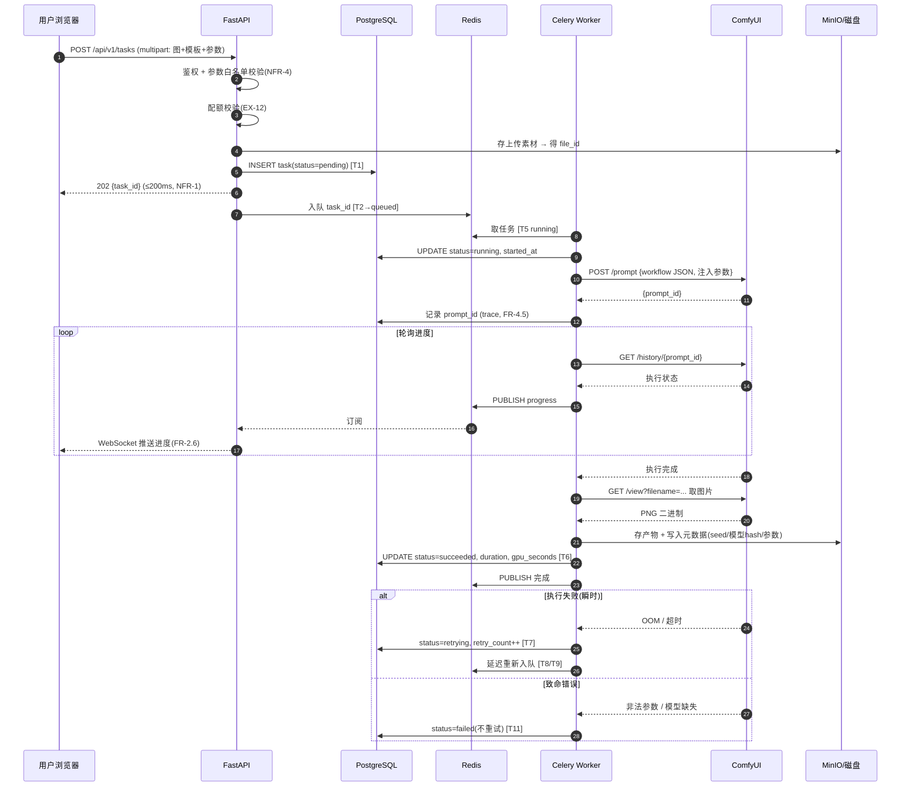
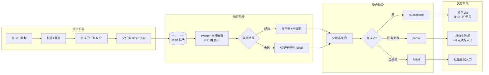

# 系统流程图与数据流图

> 版本：v1.1 · 日期：2026-09-17 · 作者：Peterwong666
> 上游：`../prd/PRD_v1.md` §4 NFR · §5 状态机 · `todolist.md` §3 技术架构
> 覆盖任务：**P1-15**
> **实线 = V1 已实现/已验证**，**虚线 = V1 待实现**。避免把设计图当成现状。

---

## 1. 部署拓扑

```
┌──────────────────────────────────────────────────────────────┐
│  用户浏览器                                                    │
└────────────────────────┬─────────────────────────────────────┘
                         │ HTTPS
┌────────────────────────▼─────────────────────────────────────┐
│  Nginx（反向代理 / TLS / 静态资源）              [V1 待实现]     │
└────────┬──────────────────────────────────┬──────────────────┘
         │ /api/*                           │ /ws/*
┌────────▼──────────────────────────────────▼──────────────────┐
│  FastAPI 应用                                                  │
│  ├─ Auth / 用户 / 配额      (JWT)                              │
│  ├─ 任务 API（提交/查询/取消/重试）                              │
│  ├─ 素材与产物 API                                              │
│  ├─ 模板与工作流 API                                            │
│  └─ WebSocket 进度推送                                          │
└───┬──────────────┬──────────────┬──────────────┬──────────────┘
    │              │              │              │
    │ SQL          │ 队列          │ 对象存储      │ 进度广播
┌───▼────┐   ┌─────▼─────┐   ┌────▼────┐   ┌────▼─────┐
│Postgres│   │  Redis    │   │  MinIO  │   │  Redis   │
│元数据  │   │ 队列+缓存  │   │ 图片对象 │   │ Pub/Sub  │
└────────┘   └─────┬─────┘   └─────────┘   └──────────┘
                   │ 任务出队
            ┌──────▼───────────────────────────┐
            │  Celery Worker（GPU 并发 = 1）    │
            │  ├─ 工作流参数装配                │
            │  ├─ 调 ComfyUI HTTP API          │
            │  ├─ 轮询 /history 取结果          │
            │  └─ 状态机迁移 T1~T14             │
            └──────┬───────────────────────────┘
                   │ HTTP 127.0.0.1:8188（不对外）★
            ┌──────▼───────────────────────────┐
            │  ComfyUI v0.3.75（推理引擎）      │
            │  ├─ /prompt  提交工作流           │
            │  ├─ /history 取执行结果           │
            │  ├─ /view    取图片二进制          │
            │  └─ /ws     执行进度              │
            └──────┬───────────────────────────┘
                   │ 读写
            ┌──────▼───────────────────────────┐
            │  数据盘 /root/autodl-tmp/         │
            │  comfyui-data/{models,input,output}│
            └──────────────────────────────────┘
```

★ **安全边界**：ComfyUI **无鉴权**，端口必须只绑 `127.0.0.1`，
由 FastAPI 做鉴权与参数校验后转发。裸奔 = 送 GPU。（NFR-4）

---

## 2. 单次生成请求时序



### 2.1 为什么是「轮询 /history」而不是只靠 WebSocket

ComfyUI 同时提供 `/ws` 与 `/history`：

| 方式 | 优点 | 缺点 | 本项目用法 |
|---|---|---|---|
| WebSocket | 实时 | 连接易断，需重连与补偿逻辑 | **辅助**：用于实时进度 |
| HTTP 轮询 `/history` | 简单、幂等、可恢复 | 有延迟 | **主用**：作为状态**唯一可信源** |

> **设计决策**：进度的**权威状态以 `/history` 为准**，WebSocket 只做加速展示。
> 理由：网络抖动时 WebSocket 丢帧会导致状态永久错乱，而轮询天然自愈。
> 这也直接满足 NFR-3「优雅重启后任务可恢复」。

---

## 3. 批量任务数据流



### 3.1 子任务粒度选择

| 方案 | 说明 | 结论 |
|---|---|---|
| 1 任务 = 1 次 ComfyUI 调用（一张图） | 粒度细，失败隔离好，续跑精确 | ✅ **采用** |
| 1 任务 = 1 个 SKU 的全部图 | 粒度中，单 SKU 内失败需重跑整组 | ❌ |
| 1 任务 = 整批 | 粒度粗，一处失败全批重来 | ❌ 正是画像②的痛点 |

> **关键理由**：选「一张图 = 一个子任务」是为了支持 **FR-3.5 断点续跑精确到张**。
> 代价是 200 张 = 201 条数据库记录，但这是可接受的（NFR-2 要求队列支持 10000 任务）。

---

## 4. 状态持久化与恢复

```
                       ┌─────────────────┐
                       │   PostgreSQL    │  ← 状态权威源
                       │  task / batch   │
                       └────────┬────────┘
                                │
   Worker 心跳 ────────────────▶│ heartbeat_at
                                │
   ┌────────────────────────────▼────────────────────────────┐
   │  进程启动时的僵尸任务扫描 (T14 / EX-7)                    │
   │  SELECT * FROM task                                     │
   │   WHERE status='running'                                │
   │     AND heartbeat_at < now() - interval '5 min'         │
   │  → UPDATE status='queued'  (重新入队)                    │
   └─────────────────────────────────────────────────────────┘
                                │
                                ▼
                     任务不丢失，自动恢复（NFR-3）
```

**为什么用「心跳 + 超时」而不是「进程退出时清理」**：
Worker 可能被 `kill -9` 或 OOM Killer 杀掉，**没有机会执行任何清理代码**。
只有心跳超时这种「被动检测」才能覆盖这种情况。

---

## 5. 存储设计

| 类型 | 位置 | 内容 | 生命周期 |
|---|---|---|---|
| **模型** | 数据盘 `comfyui-data/models/{checkpoints,unet,vae,text_encoders,loras,controlnet}` | 底模与权重 | 长期，带 hash + license 登记 |
| **用户素材** | MinIO `uploads/{user_id}/{file_id}` | 上传的商品图 | 用户删除前保留 |
| **产物** | MinIO `outputs/{user_id}/{task_id}/{idx}.png` | 生成结果 | 可配置保留期 |
| **临时** | ComfyUI `output/`（数据盘） | 引擎中间产物 | 定期清理 |
| **元数据** | PostgreSQL | task / batch / 参数 / trace | 长期（审计） |

### 5.1 为什么模型放数据盘而不是 MinIO

| 方案 | 优点 | 缺点 | 结论 |
|---|---|---|---|
| 模型放 MinIO，用时下载 | 与产物统一管理 | **每次加载要下 7-23GB，完全不可行** | ❌ |
| 模型放本地数据盘（软链进 ComfyUI） | 加载快，ComfyUI 原生支持 | 多机部署需共享存储 | ✅ **V1 采用** |

> **V1 决策依据**：单机部署，模型常驻本地。多机场景（E10）V3 再考虑共享存储方案。
> 当前已实测：软链方案可行（见 `项目进展.md` #4）。

---

## 6. 与外部系统的交互

| 外部系统 | 用途 | 失败处理 |
|---|---|---|
| ComfyUI HTTP API | 提交/查询/取图 | 健康检查失败 → 重启实例（EX-8） |
| ComfyUI WebSocket | 实时进度（辅助） | 断连 → 降级为纯轮询 |
| hf-mirror.com | 模型下载（构建期，非运行时） | 断点续传（aria2c -c） |

> **注意**：模型下载**只在构建期发生**，运行时不访问外网。
> 这是商用部署的必要条件（客户环境可能没外网，E9 私有化）。

---

## 7. 数据流与合规

```
用户素材 → 上传 → [校验] → 存储 → 送入 ComfyUI → 产物 → 下载
              │
              └─ 埋点只记元信息（尺寸/格式/数量）
                 不做内容级分析（PRD §7.1 原则 3）
```

| 合规点 | 措施 | 状态 |
|---|---|---|
| 模型商用许可 | registry 记录 license，未知即不用 | ✅ 已建矩阵 |
| ComfyUI GPL-3.0 | 不 fork，仅 API 调用 | ✅ ADR-002 |
| 生成标识 | 元数据写入（V1）→ C2PA（V2） | ⚠️ V1 部分 |
| NSFW 过滤 | FR-9.4 | ⚠️ 待实现：V1 只交付**输入侧**敏感词/合规词过滤与开关（P6-13）；**视觉检测未实现** |
| 数据隔离 | user_id 隔离 | ✅ 已实现（越权一律 404：`tasks.py` 的 `_owned_task` / `assets.py` 的 `_owned_asset`） |
| 审计 | 登录/提交/删除留痕 | ✅ 已实现（`AuditLog`，全仓库 9 处写入口：assets 3 / tasks 2 / auth 3 / worker 1） |

> ⚠️ **本表的 V1 口径以 [`../adr/0008-v1-scope-reduction.md`](../adr/0008-v1-scope-reduction.md) 为准**：
> 裁定 1 —— 风格迁移工作流**顺延 V2**（V1 为「5 条可用 + 1 条顺延」）；
> 裁定 2 —— NSFW **视觉检测** V1 **明确不实现**、只保留接口与输入侧过滤。
> 所以上表 NSFW 行的 ⚠️ 不是"漏做"，而是**已裁定不做**；同理，模型商用许可行里
> 未入库的权重也**不为 V1 解锁**（「未知即不用」）。

---

## 8. 已实现 vs 待实现（诚实清单）

> **核实日期：2026-09-17。核实方式：逐行对着真实代码 / 配置 grep 与读文件，下表「证据」列的 `文件:行号` 即核实依据（不是凭印象、也不引用旧文档的结论）。**
> ⚠️ **本表此前长期过期**：曾把**早已实现**的 FastAPI 后端、前端、Celery、PostgreSQL/Redis/MinIO 一律标成「❌ 待实现」，把「设计图」当成了「现状」。本次逐行核实后重写。
> 读法只有三条口径：
> ① **✅ = 有真实环境证据**；② **⚠️ = 有代码，但（部分）未在真实环境验证**；③ **🔲 = 仍待实现**。
> **⚠️「有代码」绝不等于「已验证可用」** —— 凡未在真实环境跑过的一律标注，并写清它被什么阻塞（待 GPU / 待权重 / 部署层未做 / V1 明确不做）。

| 组件 | 状态 | 证据与如实说明 |
|---|---|---|
| ComfyUI 推理引擎 | ✅ 已跑通（真机 GPU） | SDXL 1024²/30 步 **min 4.59s / median 5.00s**；FLUX.2 klein 4 步 **min 1.52s / median 1.83s**（生产配置 `--highvram`，`项目进展.md` #18）。⚠️ 旧记载的「12.0s」是**冷启动值**、不是稳态（`项目进展.md` #15），已作废 |
| ComfyUI HTTP API 调用 | ✅ 已跑通（真机） | `/prompt` · `/history` · `/view` · `/system_stats` · `/queue` · `/upload/image` · `/upload/mask` 均真机通过（`backend/app/engine/driver.py:35-38`）。⚠️ **`WS /ws` 与端到端 `execute_task` 未真机验证**（`backend/app/engine/driver.py:39-40`） |
| 模型存储（数据盘+软链） | ✅ 已跑通 | `项目进展.md` #4；`engine/model_registry.yaml:24`（`/root/ComfyUI/models` 为数据盘软链，6 个已登记模型的 `file_size` 与 `versions.lock` 逐条一致） |
| 版本锁定 | ✅ 已完成 | `deploy/versions.lock`（**425 行**，含锁定启动参数的 `[launch]` 段，见 `项目进展.md` #18）。⚠️ 本表旧记载写「398 行」，已订正 |
| FastAPI 后端 | ✅ **有代码**（**28 条路由**） | `backend/app/main.py:59-60` + `backend/app/api/v1/router.py:10-13`；路由数 auth 3 / assets 7 / tasks 10 / catalog 6 / health 2（`grep -c "@router\."`）。⚠️ **只在离线单测里验证过**（内存 SQLite + `StaticPool`，`backend/tests/conftest.py:39-42`），**未在真实 PG / 真实 Redis 上跑过** |
| PostgreSQL / Redis / MinIO | ⚠️ **代码就位 · 均未真实验证** | 迁移：`backend/alembic/versions/20260916_1656_f9192eeddac1_initial_schema_11_tables.py`（11 张表）；对象存储抽象：`backend/app/services/storage.py:50`。<br>⚠️ **真实 PG 未验证** —— 迁移与清理的时间比较只在 SQLite 上跑过；⚠️ **真实 Redis 未验证** —— Celery broker 与 GPU 独占位都指向 `redis://127.0.0.1:6379`，从未连过；⚠️ **真实 MinIO 未验证** —— `MinioAssetStorage`（`storage.py:93`）从未连过真 MinIO，**全部存储路径由 `InMemoryAssetStorage` 替身覆盖**（`storage.py:164`）。→ `项目进度.md` §0.2 未验证清单 #1 / #2 |
| Celery Worker + 状态机 | ⚠️ **有代码 · worker 从未真实启动** | `backend/app/worker/celery_app.py:85-91`（4 个队列 `gen_high` / `gen_default` / `gen_low` / `maintenance`、`worker_concurrency=1`、beat 三条兜底 `requeue_orphans` / `recover_zombies` / `cleanup_assets`）· `backend/app/worker/tasks.py:745`（`execute_task`）· `backend/app/services/dispatch.py:35` · `backend/app/worker/concurrency.py:112`（Redis GPU 独占位）。<br>⚠️ 仓库**没有 worker 的启动脚本 / compose / runbook** ⇒ 「worker 是否真的监听 `maintenance` 队列」**未验证**（`项目进度.md` §0.2 #3）；⚠️ 端到端 `execute_task` 真出图**未验证**（`driver.py:40`） |
| WebSocket 推送 | 🔲 待实现 | 「平台 → 浏览器」的进度推送（FR-2.6）**后端零代码** —— 全仓库无任何 WebSocket 端点（`grep -rn "websocket"` 只命中引擎侧客户端与其测试）。引擎侧「平台 → ComfyUI」的 WS 订阅已写（`backend/app/engine/driver.py:263`）但**未真机验证**（`driver.py:39`）。**阻塞：待 P7 实现 + 待 GPU 验证** |
| 前端 | ⚠️ **骨架 + 三个真实页面** | 栈见 `web/package.json`（React 18 / Vite / antd / react-query / zustand）。真实页面：`web/src/pages/LoginPage.tsx` · `WorkbenchPage.tsx` · `GalleryPage.tsx`；🔲 批量 / 任务中心 / 模板库仍是占位页（`web/src/router.tsx:44-77` 走 `PlaceholderPage`）。⚠️ **浏览器人工走查未做**，只有 jsdom 级证据（`项目进度.md` §0.2 #5） |
| 鉴权与数据隔离 | ✅ 有代码 | JWT 注册 / 登录 / 当前用户（`backend/app/api/v1/auth.py:20,45,68`）+ 越权一律 404（`tasks.py` 的 `_owned_task` / `assets.py` 的 `_owned_asset`）。🔲 API Key 鉴权（P6-07）未做 |
| 配额与限流 | ⚠️ **部分交付** | 「按用户配额」已实现且已原子化（`backend/app/services/quota.py` 的单条条件 UPDATE）；🔲 **「按接口限流」与「并发上限」零实现**（全仓库无限流代码）。⚠️ 原子性只有 SQLite 证据、**真实 PG 未验证**（`项目进度.md` §0.2 #11） |
| 内容安全（FR-9.4） | ⚠️ **仅输入侧文本过滤** | ✅ 已交付：`backend/app/services/content_safety.py`（422 `CONTENT_BLOCKED`，词表 `backend/app/data/content_blocklist.json`）；🔲 **NSFW 视觉检测 V1 明确不做** —— `NullNsfwDetector` 永返 `unknown`、永不返 `safe`（`content_safety.py:407-426`）。**阻塞：V1 明确不做，顺延 V2（见 `../adr/0008-v1-scope-reduction.md` 裁定 2）** |
| 监控告警与看板 | 🔲 待实现 | 全仓库**零** prometheus / grafana / sentry / opentelemetry / metrics 实现（P10 监控告警；良品率看板 P8-05 同样未开始）。数据源侧 `image_adopted` 已由 P6-10 打通。**阻塞：待 P10** |
| Nginx 反向代理 / TLS | 🔲 待实现 | 仓库内**无任何 nginx 配置文件**（`find . -iname "*nginx*"` 零命中）。**阻塞：部署层未做** |

> 上表就是「设计图 vs 现状」的对照。⚠️ 仍待实现的行，阻塞原因分四类，**不要混为一谈**：
> **待 GPU**（三条新工作流的 L4 真实出图 / `inpaint` 蒙版极性）、**待权重或许可**（P3-07 风格迁移，见 ADR-008 裁定 1）、
> **部署层未做**（Nginx / worker 启动脚本 / 起真实 PG·Redis·MinIO）、**V1 明确不做**（NSFW 视觉检测 / 自动质检，见 ADR-008 裁定 2、3）。

---

## 9. 变更记录

| 日期 | 版本 | 变更 |
|---|---|---|
| 2026-09-15 | v1.0 | 初稿：拓扑 + 时序 + 批量数据流 + 状态恢复 + 存储设计 |
| 2026-09-17 | v1.1 | **§8「已实现 vs 待实现」逐行核实后重写**。原表把 FastAPI 后端 / 前端 / Celery / PG·Redis·MinIO 记成「❌ 待实现」，与代码严重不符（后端实为 28 条路由 + 状态机 + 队列 + 鉴权 + 对象存储抽象，前端已有登录/工作台/画廊三个真实页面）；另订正两处数字（`versions.lock` 398 → **425 行**；SDXL「12.0s」冷启动值 → 稳态 **min 4.59s**）。新增「有代码但未真实验证」的显式标注（真实 PG / Redis / MinIO / worker 启动 / 浏览器走查 / CI）与待实现行的阻塞分类 |
