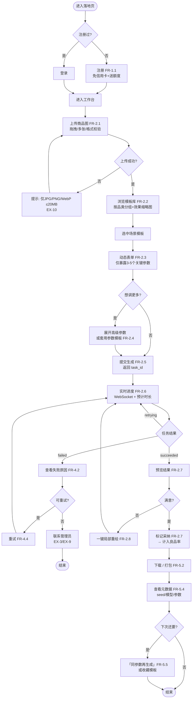
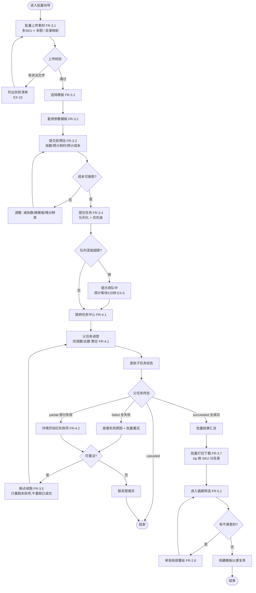

# 用户流程图

> 版本：v1.0 · 日期：2026-09-15 · 作者：Peterwong666
> 上游：`../prd/PRD_v1.md` §3 功能需求 · `../persona/persona.md` §3 旅程地图
> 覆盖任务：**P1-14**
> 说明：图中每个节点标注对应的 `FR-x.y`，确保流程与 PRD 自洽（todolist P1 DoD 要求）。

---

## 1. 主流程概览

两条主路径，覆盖两类核心 Persona：

| 路径 | 面向 | 特征 | 关键差异 |
|---|---|---|---|
| **A. 单次生成** | ① 小店主/运营 | 试水、少量、要快 | 重「看得懂、点得动」 |
| **B. 批量生成** | ② 设计师 | 量产、几百张、要稳 | 重「预估、续跑、下载」 |

---

## 2. 路径 A：单次生成（首次使用）

> 场景：张敏第一次来，要把 1 个商品做成 5 张主图。

### 2.1 关键节点说明

| 节点 | 设计要点 | 对应 PRD |
|---|---|---|
| A2 注册 | **不要信用卡**，送额度 —— 降低首用心理门槛（旅程 2 的痛点「怕收费」） | FR-1.1 |
| B1 上传 | 明确格式提示 + 拖拽 + 示例图。旅程 3 显示用户在这里「犹豫」，所以要给足确定性 | FR-2.1 |
| C1 模板库 | **最关键转化点**（旅程 3→4）。必须缩略图直观、按品类分组，否则用户挑花眼就走 | FR-2.2 |
| D1 动态表单 | **只露 3-5 个参数**。旅程 5 的痛点是「参数看不懂」，全暴露 = 劝退非技术用户 | FR-2.3 |
| E2 进度 | 单卡并发=1，必然排队。**不给进度和预计时长，用户会以为卡死** | FR-2.6 |
| F1/H1 采纳 | 「采纳」不是装饰 —— 它是北极星指标（周有效交付图片数）与良品率的唯一数据来源 | FR-2.7 |
| J1 元数据 | 可复现性的用户入口。商用场景客户会追「上次那张怎么出的」 | FR-5.4 |

---

## 3. 路径 B：批量生成（设计师量产）

> 场景：李哲要为一个店铺的 40 个 SKU，每个出 5 张场景图 = 200 张。

### 3.1 关键节点说明

| 节点 | 设计要点 | 对应 PRD |
|---|---|---|
| C1 提交前预估 | **设计师的核心诉求之一是成本可控**。不预估就提交，200 张跑完才发现成本超预算，是不可接受的 | FR-3.3 |
| F2 partial 分支 | 200 张成功 197 张失败 3 张，**不能标 failed**（用户会以为全废），也不能标 succeeded（掩盖问题） | §5.3 状态机 |
| F5 断点续跑 | 直接对应画像②的痛点：「跑到第 30 张崩了，前功尽弃」 | FR-3.5 |
| G2 按 SKU 分目录 | 打包下载如果不分目录，200 张图混在一起没法用 | FR-3.7 |

---

## 4. 异常路径汇总（与 PRD §6 对齐）

| 异常 | 用户看到什么 | 流程走向 |
|---|---|---|
| EX-1 OOM | 「显存不足，已自动降低精度重试」 | 自动转 retrying，不打断用户 |
| EX-2 超时 | 「出图超时，正在重试」 | 同上 |
| EX-3 非法参数 | 「参数不合法：步数需在 1-100」 | 前端拦 + 后端二次校验，不重试 |
| EX-4 磁盘满 | 「存储空间不足，请联系管理员」 | 停止接收新任务 |
| EX-5 排队超限 | 「当前排队 N 个，预计等待 X 分钟」 | 保留在队列，不拒绝 |
| EX-6 重复提交 | 「该任务已提交」 | 返回已有 task_id（幂等） |
| EX-7 Worker 崩溃 | 「任务已自动恢复」 | 僵尸任务扫描 → 重新入队 |
| EX-10 非法文件 | 「仅支持 JPG/PNG/WebP，≤20MB」 | 拒绝上传 |
| EX-11 单张失败 | 详情页该张标红 | 父任务继续 → partial |
| EX-12 配额耗尽 | 「额度已用完」 | 拒绝提交新任务 |
| EX-14 关页面 | —（无感知） | 任务继续执行，回任务中心可见 |

---

## 5. 流程与 PRD 的自洽性检查

| FR | 出现在流程中 | 检查 |
|---|---|---|
| FR-1.1~1.4 | A2/A3 | ✅ |
| FR-2.1~2.9 | 路径 A 全程 | ✅ |
| FR-3.1~3.7 | 路径 B 全程 | ✅ |
| FR-4.1~4.5 | E1/F2/F3/F5 | ✅ |
| FR-5.1~5.5 | G3/G5/I2/J1/J3 | ✅ |
| FR-6.x | 隐含（模板/工作流由管理后台维护） | ⚠️ 未画管理侧流程（见 §6） |
| FR-7.x | 隐含（采纳 → 良品率） | ✅ 数据链路已体现 |
| FR-9.x | 未画 | ⚠️ 见 §6 |

**结论**：C 端两条主路径完整覆盖 FR-1~FR-5；管理后台（FR-6/FR-9）的流程未展开。

---

## 6. 未覆盖部分（诚实声明）

| 缺口 | 原因 | 计划 |
|---|---|---|
| 管理后台流程（模板上架、模型管理、看板） | V1 内测期管理员即开发者本人，不画界面流程 | P7 前端开发时补 |
| 品牌方审核流程 | V1 不服务该 Persona | V2 |
| 支付/计费流程 | V1 明确不做 | V2 |
| 多租户协作流程 | V1 明确不做 | V2 |

---

## 7. 变更记录

| 日期 | 版本 | 变更 |
|---|---|---|
| 2026-09-15 | v1.0 | 初稿：2 条主路径 + 11 类异常分支 | 
