# ER 图与数据模型说明（P2-13）

> **本文档补的是 `PRD_v1.md` §9.1 的自评缺口**：
> 「数据模型设计了吗？ ⚠️ 不足 —— 本版未含 ER 图，P2-13 迁移时补」。
>
> **权威性**：表结构的唯一事实来源是代码 `backend/app/models/`，
> 建库唯一事实来源是初始迁移 `backend/alembic/versions/20260916_1656_f9192eeddac1_initial_schema_11_tables.py`。
> 本文档负责人与实现的一致性说明，**与上述两者冲突时以代码为准**。
>
> 落地状态：11 张表已定义 + 初始迁移已生成，可 `upgrade` / `downgrade`；
> 一致性由 `backend/tests/test_migration.py` 用「模型 ↔ 迁移」逐项对照钉住。

---

## 1. ER 图

```mermaid
erDiagram
    USERS ||--o{ TASKS : "user_id"
    USERS ||--o{ BATCHES : "user_id"
    USERS ||--o{ ASSETS : "user_id"

    WORKFLOWS ||--o{ TEMPLATES : "workflow_id"
    WORKFLOWS ||--o{ TASKS : "workflow_id"
    WORKFLOWS ||--o{ BATCHES : "workflow_id"

    TEMPLATES ||--o{ TASKS : "template_id"
    TEMPLATES ||--o{ BATCHES : "template_id"
    TEMPLATES }o--o| ASSETS : "example_asset_id"

    BATCHES ||--o{ TASKS : "batch_id"
    TASKS ||--o{ ASSETS : "task_id"
    ASSETS ||--o{ DEFECT_KNOWLEDGE : "related_asset_id"

    USERS {
        bigint id PK
        bigint tenant_id "V1 恒为 1，为 V2 多租户预留"
        string email UK
        string password_hash
        string role "user|admin"
        bool is_active
        int quota_total "送额度，免信用卡"
        int quota_used
        datetime last_login_at
        datetime created_at
        datetime updated_at
    }

    WORKFLOWS {
        bigint id PK
        string name "逻辑名，如 flux2_klein_t2i_v1"
        int version "同 name 多版本并存，可回滚"
        string display_name
        text description
        jsonb definition "ComfyUI API 格式节点图"
        jsonb param_schema "驱动动态表单 + 参数校验"
        jsonb param_bindings "参数 → 节点入参路径"
        bool is_active "回滚 = 旧版本置 true"
        float eval_score
        float good_rate
        datetime created_at
        datetime updated_at
    }

    TEMPLATES {
        bigint id PK
        string name
        string category "服饰/3C/家居…"
        text description
        bigint workflow_id FK
        jsonb preset_params "一键套用的预设参数包"
        bigint example_asset_id FK "效果示例图，关键转化点"
        int usage_count
        float rating
        int sort_order
        bool is_active
        datetime created_at
        datetime updated_at
    }

    BATCHES {
        bigint id PK
        bigint tenant_id
        bigint user_id FK
        string name
        string status "pending|queued|running|succeeded|failed|canceled|partial"
        bigint workflow_id FK
        bigint template_id FK
        jsonb common_params
        int total_count
        int succeeded_count "计数聚合，避免列表页 COUNT 子任务"
        int failed_count
        int canceled_count
        datetime started_at
        datetime finished_at
        datetime created_at
        datetime updated_at
    }

    TASKS {
        bigint id PK
        bigint tenant_id
        bigint user_id FK
        bigint batch_id FK "为 NULL 即单次生成"
        int idx "批内序号，便于定位失败张"
        bigint workflow_id FK
        bigint template_id FK
        string status "pending|queued|running|retrying|succeeded|failed|canceled"
        int priority "1 最高 ~ 9 最低，决定下一个跑谁"
        jsonb params "合并后的最终参数，注入工作流用"
        text prompt "params.prompt 的冗余副本，仅便于查询"
        text negative_prompt
        bigint seed
        string idempotency_key "EX-6 去重，partial unique"
        string engine_prompt_id "ComfyUI prompt_id，全链路 trace"
        int retry_count
        string error_type "ErrorType 取值"
        text error_message
        datetime queued_at
        datetime started_at
        datetime finished_at
        datetime heartbeat_at "T14 僵尸检测，不依赖进程退出钩子"
        float wait_seconds "排队时长，与执行时长必须分开"
        int duration_ms "执行时长"
        float gpu_seconds "计费用，不可用挂钟时间代替"
        float gpu_mem_peak_mb
        int degrade_count "EX-1 OOM 自动降级次数"
        jsonb degrade_actions
        datetime created_at
        datetime updated_at
    }

    ASSETS {
        bigint id PK
        bigint tenant_id
        bigint user_id FK
        bigint task_id FK "产物回指来源任务；上传素材为 NULL"
        string kind "upload|output"
        string object_key UK "MinIO key，由 ID 生成，禁止用户传路径"
        string mime_type
        bigint size_bytes
        int width
        int height
        string original_name
        bool is_adopted "★ 良品率分子的唯一来源"
        bool is_favorite
        bool is_deleted "软删除（FR-5.3）"
        jsonb meta "可复现性元数据：seed/工作流版本/模型 sha256"
        datetime created_at
        datetime updated_at
    }

    PROMPT_LIBRARY {
        bigint id PK
        bigint tenant_id
        string title
        string category
        text positive
        text negative
        jsonb tags
        int usage_count
        bool is_active
        datetime created_at
        datetime updated_at
    }

    DEFECT_KNOWLEDGE {
        bigint id PK
        string defect_type "手部畸变/文字模糊/结构漂移…"
        text symptom "现象"
        text cause "成因"
        text solution "解法"
        jsonb recommended_params "推荐参数调整"
        bigint related_asset_id FK
        int hit_count
        datetime created_at
        datetime updated_at
    }

    MODEL_REGISTRY {
        bigint id PK
        string name
        string kind "checkpoint|unet|vae|text_encoder|lora|controlnet|ipadapter|upscale|other"
        string version
        string file_path
        bigint file_size
        string sha256
        string license
        string license_url
        bool is_commercial_ok "★ 商用红线：未知一律 false"
        text license_note
        float eval_score
        float good_rate
        text eval_notes
        bool is_active
        bool is_default
        text enable_notes
        int sort_order
        jsonb extra
        datetime created_at
        datetime updated_at
    }
```



### 1.1 事件与审计（**故意不建外键**）

`events`（埋点）与 `audit_logs`（审计）在图上不参与上述关系 —— 这不是遗漏：

| 表 | 关键列 | 为什么没有外键 |
|---|---|---|
| `events` | `event_name` / `event_id`(UK) / `user_id` / `task_id` / `batch_id` / `session_id` / `ts` / `props`(JSONB) | 埋点是**只追加的事实记录**。若对 `tasks` 建外键，任务被删（`ON DELETE CASCADE`）会连带删掉埋点，指标口径随数据删除而跳变。`user_id`/`task_id` 因此是**裸 bigint** |
| `audit_logs` | `action` / `target_type` / `target_id` / `ip` / `user_agent` / `detail`(JSONB) / `ts` | 同上，且审计的价值恰恰在**主体已不存在之后**仍可追溯（FR-1.4 / NFR-4） |

两张表都**没有 `created_at` / `updated_at`**（不走 `TimestampMixin`），只有一个 `ts`：
它们按 `ts` 分区与清理，`updated_at` 无意义且会放大高频写入的成本。

---

## 2. 表清单与职责

| # | 表 | 职责 | 主要 FR |
|---|---|---|---|
| 1 | `users` | 账号、角色、配额 | FR-1.1 / FR-1.2 / FR-9.2 |
| 2 | `workflows` | 版本化工作流（节点图 + 参数 Schema + 注入映射） | FR-6.1 / FR-6.3 / FR-6.4 |
| 3 | `templates` | 场景模板 = 工作流 + 预设参数 + 示例图 | FR-2.2 / FR-2.4 / FR-3.2 |
| 4 | `batches` | 批量父任务，状态由子任务聚合推导 | FR-3.4 / FR-3.5 |
| 5 | `tasks` | **单张图**子任务，承载完整状态机 | FR-2.5 / FR-4.x / §5 |
| 6 | `assets` | 上传素材与生成产物（含采纳/收藏/软删） | FR-2.1 / FR-5.x / FR-11 |
| 7 | `prompt_library` | 提示词库（≥200 条带标签） | JD-4 |
| 8 | `defect_knowledge` | 缺陷知识库（≥30 条：现象→成因→解法→参数） | JD-9 / FR-7.3 |
| 9 | `events` | 12 个埋点事件 | FR-7.x / tracking_plan |
| 10 | `audit_logs` | 审计留痕 | FR-1.4 / NFR-4 |
| 11 | `model_registry` | 模型清单 + 许可矩阵（商用守门人） | FR-9.1 / C9 |

---

## 3. 非显然的设计决策（评审要点）

### 3.1 子任务粒度 = 一张图

`tasks` 一行 = 一张图，而非「一个 SKU」或「一次提交」。

- **为什么**：失败要能精确隔离、断点续跑要能只重跑失败的那几张（FR-3.5）。
  若以 SKU 为粒度，一个 SKU 里 3 张成功 1 张失败就得整个重跑，浪费 GPU 与用户额度。
- **代价**：`tasks` 行数 = 出图张数（1000 张批量 → 1000 行）。用 `batches` 上的
  冗余计数列（`total/succeeded/failed/canceled_count`）换掉列表页的 `COUNT` 子查询。

### 3.2 `templates.example_asset_id` → `assets` 造成的**外键环**

依赖链是：`batches → templates → assets → tasks → batches`，构成环。

- **为什么不去掉这条边**：模板的示例图是**关键转化点**（persona 旅程 3→4），
  必须能引用真实产物；`assets` 又是产出物表，无法靠挪列绕开。
- **怎么解决**：迁移里**建表时不含任何外键**，所有外键在 11 张表建好后统一
  `ALTER TABLE ... ADD CONSTRAINT`。这样与建表顺序无关，也与环无关。
  内联外键在 PostgreSQL 上必然报 `relation does not exist`（SQLAlchemy 排不出合法顺序）。
- **回归防护**：`tests/test_migration.py` 断言「最后一次 `create_table` 早于第一次
  `create_foreign_key`」，以及外键的**名字 / 源表 / 目标表**与模型逐项一致。

### 3.3 幂等键用 **partial unique index**

```sql
CREATE UNIQUE INDEX uq_tasks_idempotency
    ON tasks (user_id, idempotency_key)
    WHERE idempotency_key IS NOT NULL;
```

绝大多数任务不带幂等键。若用普通 `UNIQUE`，`(user_id, NULL)` 在 PostgreSQL 里
不冲突（NULL 互不相等），语义上不会错，但**会为每行都建索引项**、白白放大写入量。
`WHERE` 只索引带键的那小部分（EX-6）。

### 3.4 排队时长与执行时长**必须分开**

`wait_seconds`（排队）与 `duration_ms`（执行）是两个列。理由：

- 单卡串行（NFR-2）时排队可能远长于执行，混在一起会让 P95 指标失真；
- 成本模型（FR-7.5）用 `gpu_seconds`（GPU 秒）而非挂钟时间 ——
  **排队是零 GPU 成本的**，用挂钟时间算会把排队费算成 GPU 费。

`gpu_seconds` 由执行层提供，不允许用 `duration_ms / 1000` 代替。

### 3.5 `heartbeat_at` 是僵尸检测的唯一手段

Worker 可能被 `kill -9` 或被 OOM Killer 杀掉（EX-7），**没有机会执行任何清理代码**。
因此不能依赖「进程退出钩子」，只能靠心跳超时**被动检测**（迁移 T14：`running → queued`）。
`heartbeat_at` 单独建索引，供扫描使用。

### 3.6 `tenant_id` 现在没用，但必须先留

V1 单租户，所有 `tenant_id` 恒为 1、不参与筛选。留着是为了 V2 私有化 / 多租户（E9）
时只需加筛选条件，而不必做**全表数据迁移 + 所有查询改造**。`users.role` 同理。

### 3.7 枚举以字符串存储

`status` / `error_type` / `kind` / `role` 都是 `String`，不是 PG enum 类型。

- **为什么**：PG enum 增删取值需要 `ALTER TYPE`（且删值几乎不可行），而
  `TaskStatus` / `BatchStatus` / `ErrorType` 是跨流契约、**会演进**。
  取值的唯一事实来源是 `backend/app/models/enums.py`，不由数据库约束表达。
- **代价**：数据库层不拦非法取值，靠 `_apply()` 的状态迁移表 + 单测兜底
  （`tests/test_state_machine.py` 覆盖合法与非法迁移）。

### 3.8 `assets.meta` 承载可复现性

客户追单时要能复现同一张图，所以 `meta` 里记
`{seed, workflow: "xxx@v3", model_sha256, params}`（FR-5.4 / C1）。
`model_sha256` 指向 `model_registry.sha256`，两者一起才能证明「当时用的是哪个权重」。

---

## 4. 与埋点/指标的口径对应

| 指标 | 数据来源 |
|---|---|
| 良品率 = 采纳数 / succeeded 图数 | `assets.is_adopted = true` 计数 ÷ `tasks.status = 'succeeded'` 计数 |
| 智能排队时长 | `tasks.wait_seconds`（`queued_at → started_at`） |
| 单张成本 | `tasks.gpu_seconds × gpu_cost_per_second` |
| 任务成功率 | `tasks.status` 分布（`events.task_finished` 交叉校验） |
| 北极星（下载） | `events` 中 `image_downloaded` 去重计数 |

> `task_finished` **只在终态触发**（`TaskStatus.terminal()`），因此 `events` 与
> `tasks` 两张表的口径必须能对上 —— 这也是 `events` 不建外键、但保留 `task_id` 的原因。

---

## 5. 变更记录

| 日期 | 变更 | 原因 |
|---|---|---|
| 2026-09-16 | 首次成稿：11 张表 ER 图 + 设计决策说明 | 补 `PRD_v1.md` §9.1 第 9 项自评缺口（P2-13） |
