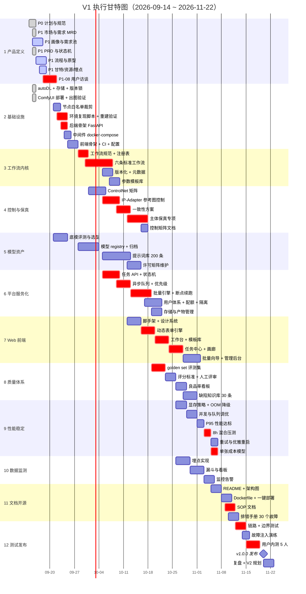

# 项目管理图：WBS · 甘特图 · 里程碑 · 关键路径

> 版本：v1.0 · 日期：2026-09-15 · 作者：Peterwong666
> 上游：`todolist.md`（13 阶段 / 约 131 任务）· `../../项目进度.md`（里程碑与周计划）
> 覆盖任务：**P1-18**
> 说明：本文档是「排期视图」，`todolist.md` 是「任务明细」，`项目进度.md` 是「执行记录」。三者编号互通。

---

## 1. WBS 工作分解结构

### 1.1 分解原则

按**交付物**分解，不按「工种」分解。理由：1 人项目没有工种划分，
唯一有意义的问题是「这周能交出什么」。

### 1.2 WBS 树

```
V1 电商视觉 AIGC 量产平台（2026-09-14 ~ 2026-11-22）
│
├── 1. 项目管理与产品定义（W1）
│   ├── 1.1 计划与规范 ....................... P0（8 任务）✅ 已完成
│   ├── 1.2 市场与需求（MRD）................. P1-01~04 ✅
│   ├── 1.3 用户与需求（画像/旅程/需求池）..... P1-05~08
│   ├── 1.4 产品需求（PRD/功能/NFR/状态机）.... P1-09~13 ✅
│   ├── 1.5 流程与原型 ....................... P1-14~17
│   ├── 1.6 项目管理图与资源 ................. P1-18~19
│   └── 1.7 埋点方案 ......................... P1-20
│
├── 2. 基础设施与环境（W1-W2）
│   ├── 2.1 autoDL 实例与存储 ................ P2-01/02 ✅
│   ├── 2.2 ComfyUI 部署与版本锁定 .......... P2-04/06 ✅
│   ├── 2.3 节点白名单裁剪 ................... P2-05
│   ├── 2.4 环境复现脚本 + 重建验证 .......... P2-07
│   ├── 2.5 后端骨架 FastAPI ................. P2-08
│   ├── 2.6 中间件 docker-compose ............ P2-09
│   ├── 2.7 前端骨架 ......................... P2-10
│   ├── 2.8 CI / 配置 / 迁移 ................. P2-11~13
│   └── 2.9 基础镜像 Dockerfile .............. P2-03（暂缓至 P11-02）
│
├── 3. 工作流内核（W2-W4）
│   ├── 3.1 工作流规范与注册表 ............... P3-01~04
│   ├── 3.2 六条标准工作流 ................... P3-05~10
│   │   ├── 文生图 ✅ 已单张验证
│   │   ├── 图生图
│   │   ├── 高清修复
│   │   ├── 局部重绘
│   │   ├── 风格迁移
│   │   └── 批量出图
│   ├── 3.3 版本化与元数据 ................... P3-11
│   └── 3.4 参数模板库 ....................... P3-12
│
├── 4. 控制体系与保真（W3-W5）★ 差异化核心
│   ├── 4.1 ControlNet 矩阵 .................. P4-01~04
│   ├── 4.2 IP-Adapter 参考图控制 ............ P4-05~07
│   ├── 4.3 一致性方案（seed/参考图锁定）..... P4-09
│   ├── 4.4 商品主体保真专项 ................. P4-10 ★ 前提型
│   ├── 4.5 SAM / DWPose / LoRA .............. P4-08
│   └── 4.6 控制能力矩阵文档 ................. P4-11
│
├── 5. 模型与提示词资产（W2-W6）
│   ├── 5.1 底模评测与选型 ................... P5-01~02
│   ├── 5.2 模型 registry + 归档 ............. P5-03~07
│   ├── 5.3 许可合规矩阵维护 ................. P5-10
│   └── 5.4 提示词库 ≥200 条 ................. P5-08~09
│
├── 6. 平台服务化（W4-W6）
│   ├── 6.1 任务 API + 状态机 ................ P6-01~04
│   ├── 6.2 异步队列 + 优先级 ................ P6-02
│   ├── 6.3 批量引擎 + 断点续跑 .............. P6-05 ★ 前提型
│   ├── 6.4 用户体系 + 配额 + 隔离 ........... P6-07~11
│   └── 6.5 存储与产物管理 ................... P6-12~13
│
├── 7. Web 前端（W5-W7）
│   ├── 7.1 脚手架与设计系统 ................. P7-01
│   ├── 7.2 动态表单引擎 ..................... P7-02 ★ 前提型
│   ├── 7.3 工作台 / 模板库 .................. P7-03~05
│   ├── 7.4 任务中心 / 画廊 .................. P7-06~08
│   ├── 7.5 批量向导 ......................... P7-09
│   └── 7.6 管理后台 ......................... P7-10~12
│
├── 8. 质量体系（W6-W7）★ 前提型
│   ├── 8.1 golden set 评测集 ≥30 例/工作流 .. P8-01~03
│   ├── 8.2 评分标准与人工评审 ............... P8-04~05
│   ├── 8.3 良品率看板 ....................... P8-06
│   └── 8.4 缺陷知识库 ≥30 条 ................ P8-07~08
│
├── 9. 性能与稳定性（W7-W8）
│   ├── 9.1 显存策略与 OOM 降级 .............. P9-01~02
│   ├── 9.2 并发与队列调优 ................... P9-03
│   ├── 9.3 P95 性能达标 ..................... P9-04
│   ├── 9.4 8h 混合压测 ...................... P9-05 ★ 验收
│   ├── 9.5 重试与优雅重启 ................... P9-06~08
│   └── 9.6 单张成本模型 ..................... P9-09 ★ 前提型
│
├── 10. 数据监测（W7-W8）
│   ├── 10.1 埋点实现（12 事件）.............. P10-01~04
│   ├── 10.2 漏斗与看板 ...................... P10-05~07
│   └── 10.3 监控告警 ........................ P10-08~10
│
├── 11. 文档与开源化（W8-W9）
│   ├── 11.1 README / 架构图 ................. P11-01
│   ├── 11.2 Dockerfile + 一键部署 ........... P11-02
│   ├── 11.3 SOP（非技术 10 分钟 100 张）..... P11-03 ★ 验收
│   ├── 11.4 排错手册 ≥30 个故障 ............. P11-04
│   └── 11.5 API 文档 / 贡献指南 ............ P11-05~13
│
└── 12. 测试与 V1 发布（W9-W10）
    ├── 12.1 链路测试 / 边界测试 ............. P12-01~02
    ├── 12.2 故障注入演练 .................... P12-03
    ├── 12.3 用户内测 ≥5 人 ................. P12-04~05 ★ 验收
    ├── 12.4 v1.0.0 发布 .................... P12-06~08
    └── 12.5 复盘 + V2 规划 ................. P12-09~10
```

### 1.3 WBS 工作量汇总

| 分支 | 任务数 | 占比 | 说明 |
|---|---|---|---|
| 1 项目管理与产品定义 | 20 | 15% | 主线 B 的产出，进作品集 |
| 2 基础设施与环境 | 13 | 10% | **已完成大半** |
| 3 工作流内核 | 12 | 9% | |
| 4 控制体系与保真 | 11 | 8% | 差异化核心 |
| 5 模型与提示词资产 | 11 | 8% | |
| 6 平台服务化 | 13 | 10% | 工作量最重 |
| 7 Web 前端 | 12 | 9% | |
| 8 质量体系 | 10 | 8% | 前提型 |
| 9 性能与稳定性 | 11 | 8% | |
| 10 数据监测 | 10 | 8% | |
| 11 文档与开源化 | 13 | 10% | |
| 12 测试与发布 | 10 | 8% | |
| **合计** | **约 146** | 100% | |

> **观察**：产品定义（15%）+ 文档（10%）= **25% 的工作量在非代码产出上**。
> 这是本项目的刻意选择 —— 目标不仅是「做完」，还要「能讲清楚怎么做完的」。

---

## 2. 甘特图



---

## 3. 里程碑

| 里程碑 | 计划 | 状态 | 关键交付物 | 验收标准 | 关联分支 |
|---|---|---|---|---|---|
| **M0 计划就绪** | 09-15 | ✅ | todolist / 项目进度 | 计划可执行、可度量 | 1.1 |
| **M0.5 仓库就绪** | 09-15 | ✅ | README / LICENSE / ADR×5 / 许可矩阵 | 仓库可克隆，规范成文 | 1.1 |
| **M1 产品定义完成** | 09-20 | 🔵 80% | 7 份文档 | 互相自洽（PRD↔原型↔流程） | 1.2~1.7 |
| **M2 环境可复现** | 09-27 | ⬜ | Dockerfile / compose / 重建脚本 | 销毁后重建仍能出同一张图 | 2.x |
| **M3 工作流可用** | 10-11 | ⬜ | 6 条工作流 + 注册表 | 6 条全部稳定出图，参数可外部注入 | 3.x |
| **M4 控制体系成型** | 10-18 | ⬜ | 控制矩阵 + 一致性方案 | 同商品 10 次生成一致性 ≥4/5 | 4.x |
| **M5 平台可跑批** | 10-25 | ⬜ | API + 队列 + 鉴权 + 存储 | 1000 张无人值守，重试成功率 ≥95% | 6.x |
| **M6 前端可用** | 11-01 | ⬜ | 工作台/任务/画廊/批量向导 | 非技术用户可自助完成全流程 | 7.x |
| **M7 质量性能达标** | 11-08 | ⬜ | golden set / 看板 / 压测报告 / 成本模型 | 良品率 ≥80%；8h 压测零崩溃 | 8.x / 9.x |
| **M8 V1 发布** | 11-22 | ⬜ | v1.0.0 + 复盘 + V2 规划 | 内测 ≥5 人，≥3 人愿继续 | 11.x / 12.x |

---

## 4. 关键路径分析

### 4.1 关键路径

```
P2-07 环境复现 ──▶ P3-01 工作流规范 ──▶ P3-05 六条工作流
                                             │
                                             ▼
                                     P6-01 任务API + 状态机
                                             │
                                             ▼
                                     P7-02 动态表单引擎
                                             │
                                             ▼
                                     P7-03/06 工作台 + 任务中心
                                             │
                                             ▼
                                     P8-01 golden set 评测
                                             │
                                             ▼
                                   P9-05 8h 压测 ──▶ P12-01 链路测试
                                                              │
                                                              ▼
                                                        P12-06 发布
```

**关键路径长度**：约 9 周（占满 W2~W10）。

### 4.2 为什么这些是关键路径

| 节点 | 为什么不能省 | 一旦延期的后果 |
|---|---|---|
| P2-07 环境复现 | 不复现就无法证明「商用」；且后置会让所有验证失效 | 全部后续验证需重做 |
| P3-05 六条工作流 | 一切上层功能的地基 | 前端/队列无内容可跑 |
| P6-01 任务 API | 前端所有数据来源 | 前端无法开工 |
| P7-02 动态表单 | 非技术用户门槛的决定因素（前提型） | 产品定位「低门槛」不成立 |
| P8-01 golden set | 良品率不可度量则无法验收 | V1 无法判定完成 |
| P9-05 8h 压测 | 商用稳定性硬门槛 | 不敢交付 |

### 4.3 可并行 / 有浮动时间的分支

| 分支 | 浮动时间 | 说明 |
|---|---|---|
| 5 模型与提示词资产 | ~1 周 | 提示词库可延后，不影响主链路 |
| 10 数据监测 | ~1 周 | 埋点可先埋事件，看板后置 |
| 11 文档与开源化 | ~0.5 周 | 但 SOP 在关键路径上（P11-03） |
| 4 控制体系（部分） | ~0.5 周 | 保真专项在关键路径上，其余有浮动 |

### 4.4 并行策略（1 人项目的现实做法）

单线程的人做并行，只能靠**「等待期填任务」**：

| 等待场景 | 填充任务 | 已实践 |
|---|---|---|
| 模型下载中（GPU 空闲） | 写产品文档（P1 全系） | ✅ 本日已做 |
| GPU 无卡模式（省钱） | 写代码骨架、文档、配置 | ✅ 本日已做 |
| 压测运行中（8h） | 写文档 / 排错手册 | 计划 |

---

## 5. 缓冲与风险排期

### 5.1 缓冲设置

| 位置 | 缓冲 | 理由 |
|---|---|---|
| W2 末 | 0.5 天 | 环境复现易出意外 |
| W4 末 | 1 天 | 六条工作流工作量估计最不确定 |
| W7 末 | 1 天 | 良品率若 <80% 需调优（MRD 风险 #1） |
| W9 末 | 1 天 | 内测反馈需修补 |

**总缓冲：3.5 天**，占总周期 10 周的 5%。偏紧，主要靠「提前识别风险」而非事后救火。

### 5.2 风险与排期联动

| 风险 | 触发点 | 排期应对 |
|---|---|---|
| R1 良品率 <80% | W6 首轮评测 | **评测前置到 W6**（ADR-003），留 W7-W8 两轮调优窗口 |
| R2 环境不可复现 | W2 | 缓冲 0.5 天 + 版本锁定已提前完成 |
| R4 模型许可问题 | 随时 | 许可矩阵已建，未知即不用；不阻塞主链路 |
| ComfyUI 不支持 FLUX.2 klein | 下载后冒烟测试 | 若失败则升级 ComfyUI 或退回 SDXL 单底模（不影响关键路径） |
| 用户访谈难约（P1-08） | W1 | 允许用二手资料补足，不阻塞 M1 |

### 5.3 真实排期的三个不确定

必须诚实标明，避免甘特图给人虚假的确定感：

1. **P1-08 用户访谈的档期不由我控制** —— 若 W1 约不到人，M1 验收标准需降级为「文档自洽 + 二手资料佐证」。
2. **FLUX.2 klein 的实测性能未知** —— 若 P95 > 60s（NFR-1 目标），需重新评估它是否适合 V1 主用。
3. **8h 压测的结果未知** —— 若暴露 OOM 或崩溃，P9 可能超期 2-3 天，需从分支 5 的浮动时间里借。

---

## 6. 资源负荷

| 周 | 主题 | 主线 | 任务数 | 负荷 | 备注 |
|---|---|---|---|---|---|
| W1 | 定方向 + 打地基 | B 为主 | ~40 | 🔴 高 | 产品文档集中产出 |
| W2 | 环境可复现 + 工作流起步 | A 为主 | ~20 | 🟡 中 | |
| W3 | 六条工作流 + 控制体系 | A | ~18 | 🟡 中 | |
| W4 | M3 工作流可用 + 服务化 | A | ~16 | 🟡 中 | |
| W5 | M4 控制体系 + 服务化主体 | A | ~16 | 🟡 中 | |
| W6 | M5 平台可跑批 + 质量启动 | A | ~18 | 🔴 高 | 后端+前端并行 |
| W7 | M6 前端 + 质量体系 | A | ~18 | 🔴 高 | |
| W8 | M7 质量性能达标 | A | ~20 | 🔴 高 | 压测耗时长 |
| W9 | 文档与开源化 | A+B | ~16 | 🟡 中 | |
| W10 | 测试与发布 | A+B | ~12 | 🟢 低 | 留出复盘时间 |

> **负荷判断**：W1/W6/W7/W8 为高峰周，每天需 6h+ 满负荷。
> 若某周实际投入不足，优先牺牲**分支 5（模型资产）与分支 10（数据监测）**，
> 因为它们有浮动时间且不阻塞验收。

---

## 7. 变更记录

| 日期 | 版本 | 变更 | 原因 |
|---|---|---|---|
| 2026-09-15 | v1.0 | 初稿：WBS（12 分支/146 任务）+ 甘特 + 10 里程碑 + 关键路径 + 缓冲 | P1-18 交付 |
| 待定 | v1.1 | 依据 P1-08 访谈与 FLUX.2 实测回填 | 降低不确定性 |
